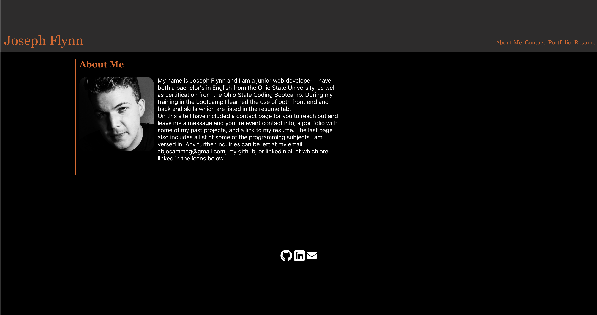

# React-Portfolio
- This is my portfolio using react; a bit of an upgrade from my last one, though my graphic design capabilities remain pretty bad. It features an About Me page, which is the landing page, as well as a contact page, a page with my resume and skills, and a portfolio page which includes my projects.
- I started by running the react install with the npx command, and from there I created a components folder in the src folder and filled it with the various pages and submenus I would need.
- My first order of business was the header, and getting it to look proper and display the things I wanted. It took a bit of battling with CSS, but it ended up okay.
- Part of the challenge of the header came with the nav bar, which I struggled with for a while. Getting it to highlight the current page was not easy, and using states was a challenge, namely array states. In the end I got it working, but it feels as though I could have gotten it working a bit more efficiently.
- The contact page was next, and while it didn't initially work, all I had to do was change a few lines and it began to operate properly. Some small errors, but most of the code remained the same.
- The about page and resume page were pretty seemless, mostly requiring a battle with CSS, but they worked in time.
- The portfolio page was a nightmare of CSS and I ended up having to do inline styling to get any of it to work. What is there now is a miracle, as the images in this project were not working until I found out from AskBCS that I could import them inline.
- Once the pictures were working, things went smoothly, save for an issue with the routes, which an askBCS assistant helped with; apparently I was missing a capital C on the Component call.

[link]()
